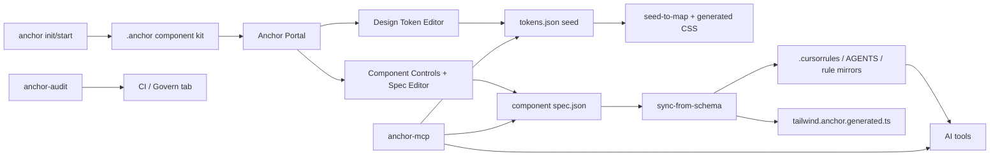

# Design-anchor 项目审查与汇报材料

日期：2026-05-25
范围：当前工作区 `/Users/gus/Documents/Design-anchor` 的代码、文档、CLI、Portal、Token、Schema、MCP 与 Audit 管线。
说明：当前工作树已有未提交改动；本报告基于“工作区现状”分析，未回退或覆盖任何现有改动。

## 1. 一句话定位

Design-anchor 不是普通的 React 组件库，而是一套面向 AI 编码时代的“设计系统治理管线”：用 design token 控制视觉，用 component spec 固化组件契约，用 Portal 让设计/工程可视化维护，用 CLI/MCP/规则文件把约束同步给 Cursor、Claude Code、Copilot 等 AI 工具，并用 audit 提供可执行的合规拦截。

## 2. 核心卖点

1. **AI-first 的差异化定位明确**
   传统组件库解决“有没有组件”，Design-anchor 进一步解决“AI 会不会乱用组件、乱写颜色和间距”。这是很强的产品叙事：给设计系统下锚，给 AI 生成 UI 上治理。

2. **Token 管线闭环完整**
   `tokens.json` 的少量 seed 通过 `seed-to-map.mjs` 派生出 200+ CSS variables，再由 `emit-design-tokens-css.mjs` 写入 Tailwind v4 `@theme` 与 `:root/.dark`。这让主题调整可以影响全组件，而不是只改几处样式。

3. **Component spec 是机器可读契约**
   每个组件有 `src/anchor/schema/components/*.spec.json`，包含 intent、wrapped primitives、forbidden tags、styleLock、examples、AI prompt。它既能生成 `.cursorrules`/规则镜像，也能被 Portal 和 MCP 使用。

4. **Portal 已从 Storybook 迁移为自研工作台**
   `src/anchor-portal` 已具备 Docs、Design Token、Components、Govern、Onboarding 等入口，降低了后续产品化受 Storybook 框架约束的风险。

5. **MCP + 规则文件覆盖多个 AI 工具**
   项目会生成 `.cursor/rules`、`CLAUDE.md`、Copilot instructions、`.mcp.json` 等，让 AI agent 可以读组件、读 schema、跑 audit、触发同步。

6. **图片参考工作流有产品判断力**
   “提取并覆盖 token”和“遵循现有 token”二选一，避免 AI 从截图里偷抄颜色/间距，这是很适合企业设计治理的边界设计。

7. **Govern tab 是很好的差异化界面**
   当前新增的治理页把 audit、组件使用、规则文件新鲜度、MCP 工具暴露情况集中展示，比单纯的 theme generator 更像一个“AI UI 治理控制台”。

## 3. 产品架构概览

主要模块：

- `bin/anchor.mjs`：CLI 编排，负责 init/start/dev/sync/audit/mcp/theme/screenshot/upgrade。
- `bin/anchor-mcp.mjs`：MCP stdio server，对 AI agent 暴露组件、token、schema、audit、sync 能力。
- `src/components/base`：组件库真源，含 shadcn/Radix 对齐组件与 AI 组件子目录。
- `src/design-tokens`：token seed、派生算法、token editor、story controls、class audit controls。
- `src/anchor/schema`：组件契约类型与 64 个 `spec.json`。
- `src/anchor-portal`：自研 Portal，包含 Docs、Design Token、Components、Govern、Onboarding。
- `scripts`：同步、审计、生成 CSS、schema 加载与规则渲染。
- `vite-plugin-schema-api.mjs`：Portal dev server 的本地 API 层，负责读写 schema/tokens、导入组件、查询治理状态。

## 4. 当前代码健康度

已通过：

- `npm run typecheck`：通过。
- `npm run anchor:audit`：通过（app scope）。
- `npm run anchor:audit -- --scope kit`：通过。
- `npm run anchor:audit:all`：通过，app / kit / portal 三层共扫描 103 个 `.tsx`。
- `npm run build`：通过，CSS `@import` 与 Vite chunk size warning 已清除。
- `npm run check:anchor`：通过，覆盖 64 个 spec 与 13 个 MCP 工具。

需要注意：

- `anchor:audit` 已增加 `app / kit / portal / all` 分层 scope。当前 app、kit、portal 三层均通过；后续可继续扩大审计规则覆盖（例如更多动态 className 解析）。
- 当前 `git status` 显示已有多处未提交改动，包括 CLI、MCP、Portal、token、生成 CSS、Vite middleware 等。本报告没有改动这些业务代码。

## 5. 重点问题与风险

### P0/P1：MCP token 能力与 v2 token 结构不匹配

当前 `tokens.json` 是 v2 seed 结构：`version: 2`、`seed`、`seedDark`、`customSeeds`、`mapOverrides`。但 `bin/anchor-mcp.mjs` 的 `list_tokens`/`update_token` 仍按旧版 `doc.tokens[]` 实现：

- `listTokens()` 返回 `(doc.tokens || [])`，在 v2 下会返回空数组。
- `updateToken()` 查找 `(doc.tokens || []).find(...)`，用 `colorPrimary` 等 seed id 会报不存在。
- CLI screenshot prompt 明确要求 AI 调 `update_token` 写 `colorPrimary/colorBgBase/fontSize/sizeUnit` 等 seed，因此这条链路当前会断。

建议：把 MCP token API 升级为 v2-aware。`list_tokens` 返回 seed、seedDark、customSeeds、mapOverrides 的结构化清单；`update_token` 支持 `{ id, field: "seed" | "seedDark" | "customSeeds" | "mapOverrides.light" | "mapOverrides.dark", value }`，或保留 light/dark 兼容层并映射到 seed/seedDark。更新后自动运行 `npm run sync:tokens`。

### P1：MCP 工具名与文档/提示词不一致

真实 MCP 工具名是 `sync_rules`，但 README、Portal docs、CLI 规则文本、screenshot prompt 都写 `run_sync_rules`。AI 按文档调用会失败。

建议：最稳妥是 MCP 同时暴露 `sync_rules` 和 `run_sync_rules` 两个别名，并统一文档。对外推荐 `run_sync_rules`，内部兼容 `sync_rules`。

### P1：`@design` barrel 与 spec/export 映射不完整

`src/components/base/index.ts` 没有导出很多 spec 声明的 primitives，例如 `AccordionHeader`、`SelectPortal`、`PopoverArrow`、`TooltipArrow`、`Sidebar*`、`DataTable`、`Toaster`，也没有导出 `src/components/base/ai/index.ts`。一致性检查显示 37 个 spec 有“声明但未从当前 base barrel 导出”的符号。

这会影响两类路径：

- 如果消费者按 README 将 `@design` 指向 `src/components/base` barrel，会出现“spec 说可用，但 import 不到”。
- `anchor init` 生成的 `.anchor/index.ts` 当前只遍历 `src/components/base` 的直接文件，不递归导出 `base/ai` 子目录，AI 组件对消费者也不完整。

建议：建立一个 `check:exports` 脚本，CI 校验 `spec.componentName + wraps.primitives` 是否能从 `@design` 入口导入。修复方式可以是：统一维护根 barrel，导出 `./ai`，补齐新 Radix primitives；或者让 generated index 递归并按 spec 导出。

### P1：Controls 的 select/multi-select 会把非字符串 option 改成字符串

`ControlInput.tsx` 的 select 使用 `String(opt)` 作为 option value，并在 change 时传回 `e.target.value`。这对字符串枚举正常，但会破坏 number、boolean、null、object 类型。当前 `DataTable.demo.tsx` 的 `columnBandIndex` options 是 `[null, 0, 1]`，一旦通过 UI 改值，会变成 `"0"`/`"1"` 字符串。

建议：select 内部维护 option index 或 key->原值映射，`onChange` 返回原始 option 值。multi-select 同理返回原始值数组。

### P1：Onboarding “Import safe” 实际会导入全部文件

`OnboardingRoute.handleImport(filterRisky)` 接收了 `filterRisky`，UI 也展示 “Import safe”，但请求只发送 `{ path: scan.root }`，middleware `/api/import-component-path` 会按路径导入所有 direct-child `.tsx`。这会让用户以为只导入 safe 文件，实际 warn/risky 也被拷入。

建议：前端传 `files` 或 `allowedAbsPaths`；后端只导入前端确认的文件列表，并重新校验这些路径属于 scan root。

### P1：Empty library 模式可能因 `base/ai` 子目录删除失败

`/api/clear-components` 对 `src/components/base` 下每个 entry 调 `fs.rmSync(path, { force: true })`，没有 `recursive: true`。当前 `base` 下存在 `ai/` 目录，删除目录会抛错，导致 empty 模式失败。

建议：改为 `fs.rmSync(path, { recursive: true, force: true })`，并清理相关 spec/demo/index/kit-status 的一致性状态。

### P2：部分 spec 的 `componentName` 与真实导出名不一致

例子：

- `sonner.spec.json` 的 `componentName` 是 `Sonner`，真实导出是 `Toaster`。
- `input-otp.spec.json` 的 `componentName` 是 `InputOtp`，真实导出是 `InputOTP`。
- `resizable.spec.json` 的 `componentName` 是 `Resizable`，真实导出是 `ResizablePanelGroup/ResizablePanel/ResizableHandle`。

这会影响 AI prompt、规则、Portal 匹配、MCP 读写，以及未来自动 import。

建议：明确 spec 的主组件命名规则：要么 `componentName` 必须是可 import 的符号，要么新增 `displayName`/`primaryExport` 字段分离展示名和导出名。

### P2：MCP 创建组件仍使用 `.stories.tsx`

`create_component` 写入 `${name}.stories.tsx`，但项目已经迁移到 `.demo.tsx`。这会让 MCP 新建组件无法进入当前 `story-registry.ts` 的 `*.demo.tsx` 发现逻辑。

建议：MCP 新建组件使用 `.demo.tsx`，并复用 Portal import 生成 demo 的模板。

### P2：文档仍有 Storybook 与版本信息残留（已处理）

此前检查发现：`docs/PRODUCT_ARCHITECTURE.md`、`docs/BOUNDARIES.md`、`bin/anchor.mjs` 注释和部分 README 文案存在 Storybook 时代残留；README 的 Vite 版本表达也需要和 `package.json` 对齐。

处理：本轮已将核心 README、docs index、产品采用指南、产品架构文档和 CLI help 文案统一到 Anchor Portal / Vite Portal 叙事，并补充中英双语的 B 端/长期产品采用材料。

### P2：Audit 的产品承诺与实际扫描范围需要分层

当前 audit 设计上排除了组件库和 Portal，适合作为“业务代码合规扫描”。但产品对外叙事强调硬编码颜色/任意 spacing 会被拒。如果用户理解为全仓库扫描，当前实现会有落差。

建议：增加 audit profile：

- `anchor audit --app`：扫描业务代码，默认当前行为。
- `anchor audit --kit`：扫描组件库，允许明确白名单，例如 `var(--*)`、layout sizing。
- `anchor audit --all --json`：给 CI/Govern 使用。

## 6. 产品优化方向

短期优先级：

1. 修 MCP v2 token、工具名别名、MCP create demo 后缀。
2. 修 `@design` 入口导出和 spec/export 一致性。
3. 修 Controls option 类型保真。
4. 修 Onboarding safe import 与 empty library 删除。
5. 文档去 Storybook 残留，并对齐 Vite 版本。（已完成）

中期增强：

1. 增加 schema validation：启动/保存/sync 前校验 spec 字段、导出符号、forbidden tag、enumMap class 是否可解析。
2. 增加 CI 模板：`typecheck + audit --app + check:exports + check:mcp-docs + build`。
3. Govern tab 增加“问题可操作入口”：点击 stale rule 直接跑 sync，点击 export mismatch 给修复建议。
4. Token customizer 增加 snapshot diff 和 preset library，帮助产品演示“换肤前后”的价值。
5. MCP 工具返回结构化 JSON，而不是大段文本，便于 AI agent 稳定消费。

长期产品化：

1. VS Code/Cursor extension：把 audit 结果、token 改动、spec 违规直接显示在编辑器 UI。
2. 企业 CI/PR bot：在 PR 中评论硬编码 token、组件误用、schema drift。
3. 设计资产导入：Figma/截图/Design Prompt 到 token diff 的可审核流程。
4. 多项目治理：preset、组织级 token、组件版本迁移报告。

## 7. 汇报建议主线

建议汇报时不要把它讲成“又一个 shadcn 组件库”。更强的讲法是：

1. AI 编码让 UI 漂移变成高频问题。
2. Design-anchor 用 token、schema、rules、MCP、audit 把软规范变成硬管线。
3. Portal 让设计和工程能共同维护这个管线。
4. 当前最有价值的差异化页面是 Govern：它能证明项目是否真的被治理。
5. 下一阶段重点是把“工具链映射正确性”和“可执行审计深度”打磨成可靠产品。

## 8. 本次验证记录

- `npm run typecheck`：通过。
- `npm run anchor:audit`：通过，app scope 扫描 1 个 `.tsx`。
- `npm run anchor:audit -- --scope kit`：通过，扫描 69 个 `.tsx`。
- `npm run anchor:audit:all`：通过，app / kit / portal 三层共扫描 103 个 `.tsx`。
- `npm run build`：通过，最大 route chunk 为 DesignTokenRoute（约 471KB），低于默认 warning 阈值。
- `npm run check:anchor`：通过，64 个 spec / 13 个 MCP tools 对齐。
- 结构检查：
  - root-level component `.tsx`：55 个。
  - demo 文件：50 个。
  - spec 文件：64 个。
  - AI 组件 spec 有 12 个位于 `src/components/base/ai`，当前 root barrel/generateIndex 已纳入 base barrel。
  - 已新增 `scripts/check-anchor-consistency.mjs`，用于校验 spec componentName、wraps.module、base barrel 与 MCP 工具名。
